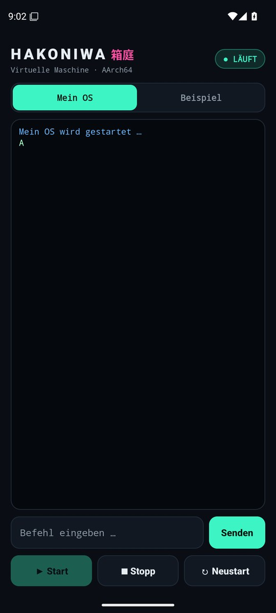
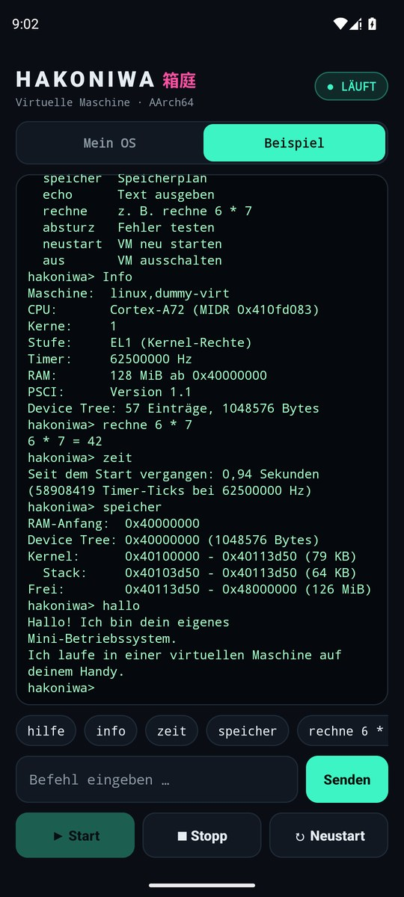

# HAKONIWA 箱庭

Android-App, die auf dem Handy eine virtuelle Maschine startet. Darin läuft ein eigenes,
kleines Betriebssystem. Dein echtes Android wird dabei nicht verändert, und die App braucht kein Root.

<p align="center">
  
  
</p>

## Download

Die neueste APK gibt es unter [Releases](../../releases/latest). Auf dem Handy öffnen und installieren.
Android warnt dabei vor einer unbekannten App, weil sie nicht aus dem Play Store kommt.
Neue Versionen einfach über die alte installieren.

## Benutzen

Oben in der App wählst du, was in der virtuellen Maschine läuft:

- **Mein OS** ist dein eigenes Betriebssystem. Es beginnt bei null: Am Anfang zeigt es nur
  einen einzigen Buchstaben an. Du baust es Schritt für Schritt selbst aus, siehe [`mein-os/`](mein-os).
- **Beispiel** ist ein fertiges Mini-Betriebssystem mit Befehlen. Es zeigt, wie weit man kommen kann.

Beim Öffnen der App startet die VM automatisch. **Stopp** beendet sie, **Neustart** startet sie frisch,
**Start** schaltet sie wieder ein. Beim Beispiel kannst du unten Befehle eintippen
oder einen Schnellbefehl antippen:

| Befehl | Was er macht |
| --- | --- |
| `hilfe` | zeigt alle Befehle |
| `info` | Daten der VM: CPU, Speicher, Timer |
| `zeit` | Zeit seit dem Start |
| `speicher` | wo der Kernel im Speicher liegt |
| `echo Text` | gibt den Text aus |
| `rechne 6 * 7` | rechnet mit `+ - * / :` |
| `absturz` | löst absichtlich einen Fehler aus (danach Enter = Neustart) |
| `neustart` | startet die VM neu |
| `aus` | schaltet die VM aus |

## Aufbau

- `mein-os/` – dein eigenes Betriebssystem, Schritt für Schritt. Es startet ohne fremden Code
  direkt auf der virtuellen CPU (AArch64).
- `beispiel-os/` – das fertige Mini-Betriebssystem (C und Assembler) mit einer kleinen Kommandozeile.
- `app/` – die Android-App (Kotlin). Sie startet QEMU und zeigt an, was das Programm in der VM ausgibt.
- `qemu/` – baut [QEMU](https://www.qemu.org) für Android. QEMU stellt die virtuelle Maschine
  bereit: Prozessor, 128 MB Speicher und eine serielle Schnittstelle.
- `tests/` – automatische Tests für beide Betriebssysteme und die App.

## Selber bauen

Jeder Push auf `main` baut über GitHub Actions alles neu:
beide Betriebssysteme (mit Test in QEMU), QEMU für Android (arm64 und x86_64),
Test der Handy-Version von QEMU auf einem ARM-Rechner, APK, Test der App im Android-Emulator,
danach ein Release mit der APK. Die Protokolle jedes Laufs landen im Zweig `ci-ergebnis`.
Dafür braucht der Build das Secret `KEYSTORE_PASSWORD`. Wer das Projekt kopiert, braucht einen eigenen Schlüssel.

Die Betriebssysteme lassen sich auch auf einem Linux-Rechner testen:

```sh
sudo apt install clang lld qemu-system-arm
make -C mein-os run       # Beenden: Strg+A, dann X
make -C beispiel-os run
```

## Lizenz

GPL-2.0, wie QEMU. Die App enthält QEMU 11.0.3
([Quellcode](https://download.qemu.org/qemu-11.0.3.tar.xz)) und GLib 2.88.4
([Quellcode](https://download.gnome.org/sources/glib/2.88/glib-2.88.4.tar.xz), LGPL-2.1).
Die Änderungen für Android stehen in `qemu/`. Auf Anfrage gibt es den vollständigen Quellcode
jeder veröffentlichten Version.
